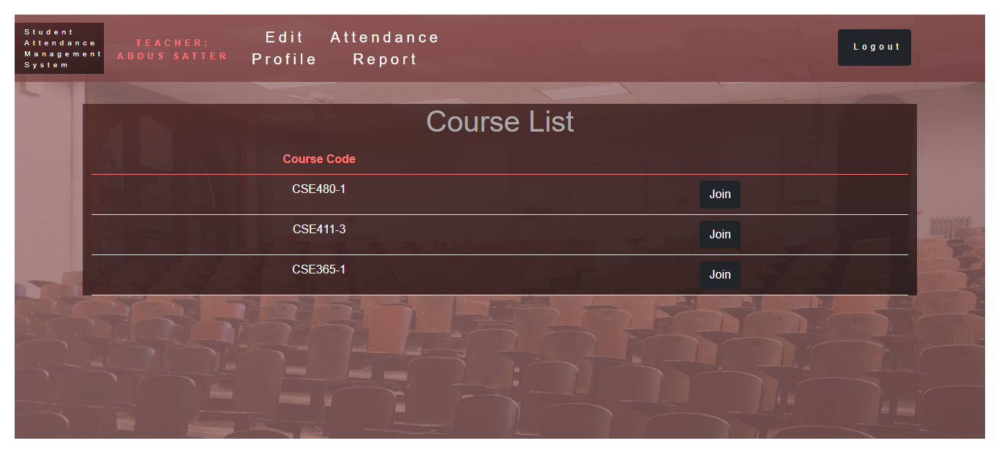
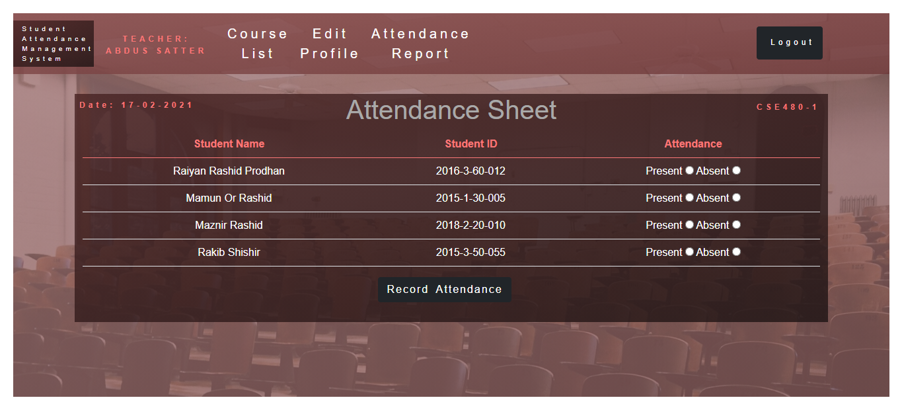
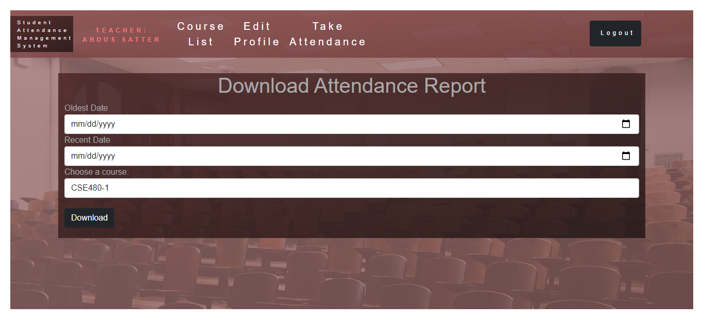
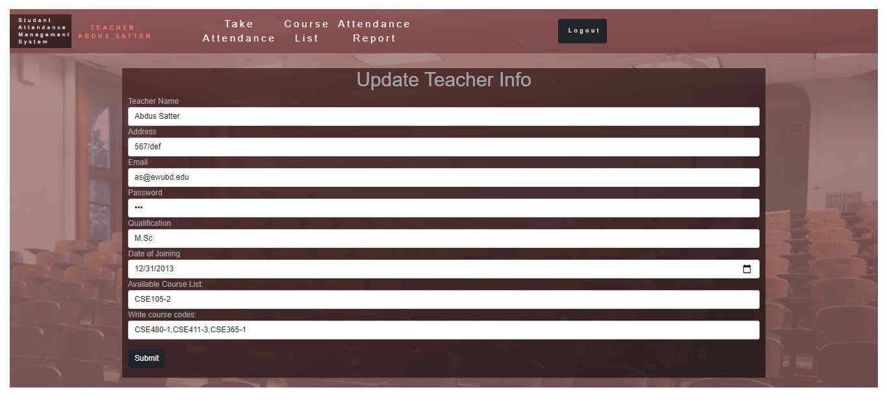

# student-attendance-management-system
A student attendance management system built with HTML5, CSS3, Bootstrap4, PHP OOP, MySQL, FPDF. This web app is built in a way that only the teacher will be able to enjoy the full privilege.

### To login as a teacher: 
Email: as@ewubd.edu  
Password: 123

### To login as a student: 
Email: 2016-3-60-012@std.ewubd.edu  
Password: 123

### Features:
* Signup 
* Login 
* Show course list
* Add new user
* Update existing user info
* Delete a user account
* Take attendance
* Generate a downloadable pdf of attendance report  

### Some screenshots of the web app
#### Home Page

#### Attendance Sheet

#### Attendance report

#### Update Profile

